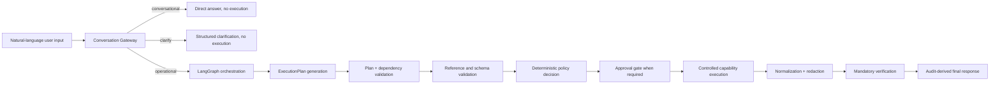

# XFusion Judge-Facing Design Document

This document is written to satisfy section `4.4` of the AI Hackathon 2026 preliminary problem statement. That section asks for:

- the overall architecture design of the intelligent agent
- the implementation progress and depth of each capability
- the behavior-design logic, intent parsing algorithm, and design tradeoffs

XFusion is a capability-governed Linux operations agent for real server administration. Its core design goal is not to emulate an unrestricted shell. Its goal is to let a user issue natural-language Linux operations requests while keeping execution deterministic, auditable, policy-bounded, and reviewable.

## 1. System Positioning

The contest problem asks for a system that can:

- run in a real Linux environment
- understand natural-language system-management requests
- execute operational tasks
- provide clear process and result feedback
- recognize and control risky operations
- support multi-turn and multi-step interaction where possible

XFusion addresses that requirement with a hybrid architecture:

- LLMs help with request understanding, clarification, planning, explanation, and bounded retrieval
- deterministic infrastructure retains all authority over execution, policy, approval, schema validation, redaction, verification, and audit

The governing product claim is:

> The model may propose. The system authorizes and executes.

## 2. Overall Architecture Design

The judge-facing execution loop is:

### 2.1 Major Components

`Conversation Gateway`

- Classifies each user turn as `conversational`, `clarify`, or `operational`
- Prevents orchestration from running on unclear or non-operational input
- Produces structured clarification instead of letting the system guess

`Planning and orchestration`

- Converts operational input into an `ExecutionPlan`
- Uses LangGraph state to manage steps, dependencies, approvals, verification, and authoritative response building
- Ensures every operational request becomes a typed workflow, even for one-step tasks

`Capability registry`

- Defines the only executable surface
- Every step must invoke one registered capability with typed arguments and typed outputs
- Unknown capabilities fail closed

`Policy and approval engine`

- Applies deterministic risk evaluation to each step
- Distinguishes read-only actions, bounded mutations, higher-risk mutations, and prohibited actions
- Requires typed confirmation phrases for approval-bound actions
- Invalidates approval if plan shape, arguments, or policy state materially change

`Controlled runtime`

- Executes reviewed adapters or constrained argv bindings rather than arbitrary shell passthrough
- Validates output shape before a step can be treated as successful

`Verification and audit`

- Requires post-action verification for execution steps
- Produces append-only audit records
- Derives final user-facing explanations from authoritative audited state

## 3. Behavior Design Logic

### 3.1 Intent Handling Strategy

XFusion does not directly map free-form user text to shell commands. It uses a staged decision model:

1. The gateway decides whether the turn is conversational, clarification-required, or operational.
2. Operational turns are converted into a typed plan over registered capabilities.
3. Deterministic validation checks step shape, dependencies, references, and capability schemas.
4. Deterministic policy decides whether the action is allowed, approval-bound, or denied.
5. Only approved and validated steps may execute.

This design intentionally narrows the model boundary. The LLM can help interpret intent, but it cannot directly trigger state-changing execution.

### 3.2 Clarification and Multi-Turn Behavior

The problem statement encourages multi-turn capability and contextual understanding. XFusion supports short-lived operational context with conservative rules:

- unclear target, scope, or action requests produce structured clarification
- direct follow-up answers can be threaded back into the next classification step
- negative replies to clarification or approval prompts resolve to safe cancellation
- session memory is intentionally short-lived and scoped to the active plan or clarification thread

This favors safety and predictability over open-ended memory.

### 3.3 Risk and Safety Logic

XFusion uses deterministic risk tiers:

- `tier_0`: read-only inspection
- `tier_1`: bounded reversible mutation, human approval
- `tier_2`: high-risk mutation, admin approval or stronger control
- `tier_3`: prohibited or broad-impact action, denied

Protected targets include core system areas such as `/`, `/etc`, `/boot`, `/usr`, and `/var/lib`, as well as dangerous broad-impact changes like recursive privilege changes or unclear destructive deletion.

This directly addresses the contest’s advanced requirement for:

- high-risk operation recognition
- risk warning
- understandable risk explanation

### 3.4 Verification and Explainability Logic

XFusion treats execution as incomplete until verification is performed. The system therefore presents a full operational loop:

- request understood
- action planned
- policy checked
- approval collected if needed
- action executed through typed capability
- state re-checked or otherwise verified
- result summarized from audit state

This is important for the contest because it demonstrates not only “did it run” but also “did the system prove the result.”

## 4. Capability Implementation Progress And Depth

The current registered capability surface is grouped below.

### 4.1 System and environment

| Capability | Purpose | Depth |
| --- | --- | --- |
| `system.detect_os` | environment sensing, distro, package manager, sudo, disk pressure | implemented and judge-ready |
| `system.check_ram` | memory usage inspection | implemented and judge-ready |
| `system.current_user` | current user lookup | implemented |
| `system.check_sudo` | privilege availability check | implemented |
| `system.service_status` | check one service | implemented |
| `system.list_services` | list services | implemented |
| `system.service_start` | start a service | implemented, approval-bound |
| `system.service_stop` | stop a service | implemented, approval-bound |
| `system.service_restart` | restart a service | implemented, approval-bound |
| `system.service_reload` | reload a service | implemented, approval-bound |
| `system.restart_failed_services` | recover failed services | implemented, approval-bound |

### 4.2 Disk and cleanup

| Capability | Purpose | Depth |
| --- | --- | --- |
| `disk.check_usage` | disk usage inspection on a path | implemented and judge-ready |
| `disk.find_large_directories` | top large directories under a scope | implemented and judge-ready |
| `cleanup.safe_disk_cleanup` | bounded preview and cleanup workflow | implemented, approval-bound, strong demo value |

### 4.3 Files

| Capability | Purpose | Depth |
| --- | --- | --- |
| `file.search` | search files by name/pattern | implemented and judge-ready |
| `file.preview_metadata` | metadata check | implemented |
| `file.read_file` | bounded file read | implemented |
| `file.append_file` | append content | implemented, approval-bound |
| `file.write_file` | write file | implemented, approval-bound |
| `file.move` | move file | implemented, approval-bound |
| `file.copy` | copy file | implemented, approval-bound |
| `file.chmod` | change mode | implemented, approval-bound |
| `file.chown` | change owner | implemented, approval-bound |
| `file.delete` | delete a specific file | implemented, high-risk bounded path only |

### 4.4 Processes and ports

| Capability | Purpose | Depth |
| --- | --- | --- |
| `process.list` | bounded process listing | implemented |
| `process.find_by_port` | find listener by port | implemented and judge-ready |
| `process.inspect` | inspect one pid | implemented |
| `process.zombie_procs` | zombie process detection | implemented |
| `process.kill` | terminate one pid | implemented, approval-bound |
| `process.terminate_by_name` | terminate by process name | implemented, approval-bound |

### 4.5 User management

| Capability | Purpose | Depth |
| --- | --- | --- |
| `user.create` | create standard user | implemented, approval-bound, directly matches contest baseline |
| `user.delete` | delete standard user | implemented, approval-bound, directly matches contest baseline |

### 4.6 Policy-explanation capability

| Capability | Purpose | Depth |
| --- | --- | --- |
| `plan.explain_action` | explain a refused action in bounded terms | implemented as refusal path support |

### 4.7 Depth Summary

Depth is strongest today in the exact areas emphasized by the problem statement:

- environment sensing
- disk inspection
- file and directory retrieval
- process and port inspection
- user create and delete
- risky-action recognition and refusal
- multi-step operational closure through verification

The current system is intentionally narrower in areas the contest does not require for full baseline credit:

- no arbitrary shell passthrough
- no persistent long-horizon memory
- no multimodal voice interface in this release
- no generic remote SSH execution surface in the primary judge story

## 5. Design Tradeoffs

### 5.1 Why XFusion avoids arbitrary shell passthrough

The fastest way to build a demo agent would be to translate user requests into shell commands. We explicitly did not choose that route. The reason is contest credibility:

- it weakens controllability
- it reduces auditability
- it makes risky behavior harder to constrain
- it becomes difficult to explain why an action was authorized

XFusion instead uses a small, typed capability surface.

### 5.2 Why the system is hybrid rather than fully deterministic

Natural-language requests are ambiguous, variable, and environment-sensitive. Pure deterministic parsing is stable but brittle. Pure model-driven execution is flexible but risky. XFusion therefore uses:

- model assistance for interpretation and planning
- deterministic enforcement for anything that can change system state

This is the central engineering tradeoff of the project.

### 5.3 Why memory is short-lived

The contest rewards multi-turn capability, but uncontrolled memory can cause action drift and unsafe reuse of stale assumptions. XFusion therefore keeps memory:

- session-local
- short-lived
- tied to the active plan or clarification thread

This improves safety and traceability, even if it limits open-ended conversation.

### 5.4 Why verification is mandatory

Without verification, an agent can only say that it attempted an action. The problem statement is about real usability in a real Linux environment. Verification turns execution into an observable operational loop and improves both objective scoring and judge trust.

## 6. Alignment With Contest Scoring

XFusion is designed to score well on both the objective and subjective parts of the rubric.

`Objective`

- `Function implementation`: covers core inspection, search, process/port handling, user operations, and safe cleanup
- `Environment perception and decision`: uses live environment sensing and environment-aware policy
- `Result feedback and execution explanation`: returns plan, policy, approval, execution, and verification-aware summaries
- `Operational closed loop`: supports single-turn, risky-turn, and multi-step workflows with verification

`Subjective`

- `User experience`: natural-language entry, explicit clarification, explicit confirmation, and readable risk hints
- `Engineering quality`: clear decision boundary between model help and deterministic authority
- `Innovation value`: treats AI as the primary Linux operations interface without collapsing into hidden shell execution

## 7. What Judges Should Look For In The Demo

The strongest judge-facing signals are:

- the system runs in a real Linux environment
- requests are expressed in natural language rather than shell syntax
- risky operations do not execute silently
- the system asks for clarification instead of guessing
- the system shows an explicit plan and approval requirement
- final results are tied to verification and audit rather than free-form model narration

## 8. Current Boundaries And Honest Non-Goals

To keep the system real and reviewable, XFusion currently does not claim:

- unrestricted administration of arbitrary Linux tasks
- a general shell replacement
- persistent memory across unrelated sessions
- full OS-level sandbox isolation
- voice-first or multimodal interaction

These are intentional scope limits, not hidden omissions.

## 9. Final Summary

Section `4.4` asks for architecture, capability depth, and behavior-design explanation. XFusion’s answer is a capability-governed hybrid agent:

- natural language in
- explicit typed plan
- deterministic safety and approval
- controlled execution
- mandatory verification
- audit-derived response

That combination is the core reason the system is suitable for a real Linux operations demo rather than a purely conceptual agent presentation.
